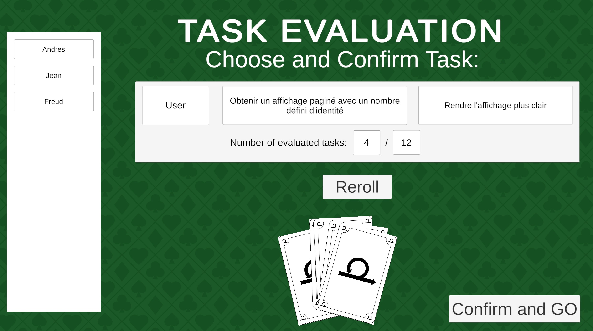

# Jeux Planning Poker - Methode Agile Scrum
## Projet conception agile
Application Unity pour simuler le "Planning Poker" de la methode agile Scrum pour l'estimation de difficulte des taches d'un Backlog.

## Description
L'application est un jeu qui reproduit les caractéristiques et les règles du Planning Poker. Dans ce jeu, vous pourrez paramétrer plusieurs éléments, tels que le nombre de joueurs, le mode de jeu (qui adapte les règles du Planning Poker en fonction des besoins des utilisateurs), un chronomètre pour le débat, la votation, ainsi que la mise en place d'un backlog personnalisé, que ce soit créé directement dans l'application ou importé à partir d'un fichier JSON. Vous pourriez a la fin (ou pendant le jeux) sauvegarder le backlog généré.
L'objectif de cette application est de rendre cette pratique Scrum plus intéressante, interactive et amusante, favorisant ainsi une bonne ambiance et motivation au sein de l'équipe lors de la spécification des besoins.

## Images Contenu Application
### Parametrage Jeux

### Debut Jeux

### Phase Vote

### Review Resultat

### Phase Debate

## Fonctionalites
- Parametre le jeux a votre gout et objectives.
- Differents Mode de jeux.
- Jeu multijoueur local.
- Definises votre Backlog depuis un Fichier JSON ou dedans le jeux
- Le Backlog peut contenir des taches deja valider.
- Choix de pseudo pour chaque joueur.
- Choisissez des cartes pour estimer des tâches.
- Affichage des choix de chaque joeur
- Carte Cafe permet de sauvegarder le Backlog dans  un nouveau JSON l'etat courrant du jeux, ainsi que continuer la partie, sortir de l'application ou recommencer une nouvelle partie.
- Bloque de notes a disposition pendant le debat qui sera affiche dans la votation. Principe de rappeler a tout les joeur des poins important de la discussion.
- A la fin du jeux, affichage des taches une par une pour analyser les estimations.
- Possibilite de sauvegarder le Backlog avec toute les taches estime a la fin du jeux.

## Utilisation
1. **Lancez l’application** depuis Unity ou un exécutable généré.
2. **Paramétrez votre jeu** et sélectionnez ou créez un backlog avec des tâches à estimer.
3. **Les joueurs choisissent leur pseudo**.
4. **Le jeu commence** : l’équipe se met d’accord pour choisir une tâche à estimer.
5. **Le vote commence** : chaque joueur émet sa propre estimation.
6. **Résumé des choix des joueurs**.
   1. Si **unanimité** : le match se termine et on choisit la tâche suivante.
   2. Si **Pas n'unanimite**: le débat commence.
   3. Si **les joueurs choisissent la carte café**: Sauvegarde d'etat courrant du Backlog, choix entre finir, relancer, ou continuer le jeux.
7. La **boucle se répète** jusqu’à ce que toutes les tâches soient validées ou que l’application soit fermée.

## Technologie utilisées
- **Unity** - Moteur de jeu.
- **C#** - Langage de programmation pour la logique de l’application.
- **Doxygen** - Generation documentation en format web du code (HTML, CSS, JS).

## Credits
### Auteurs:
#### Larmat Jean,
####  Pierre Gatien
